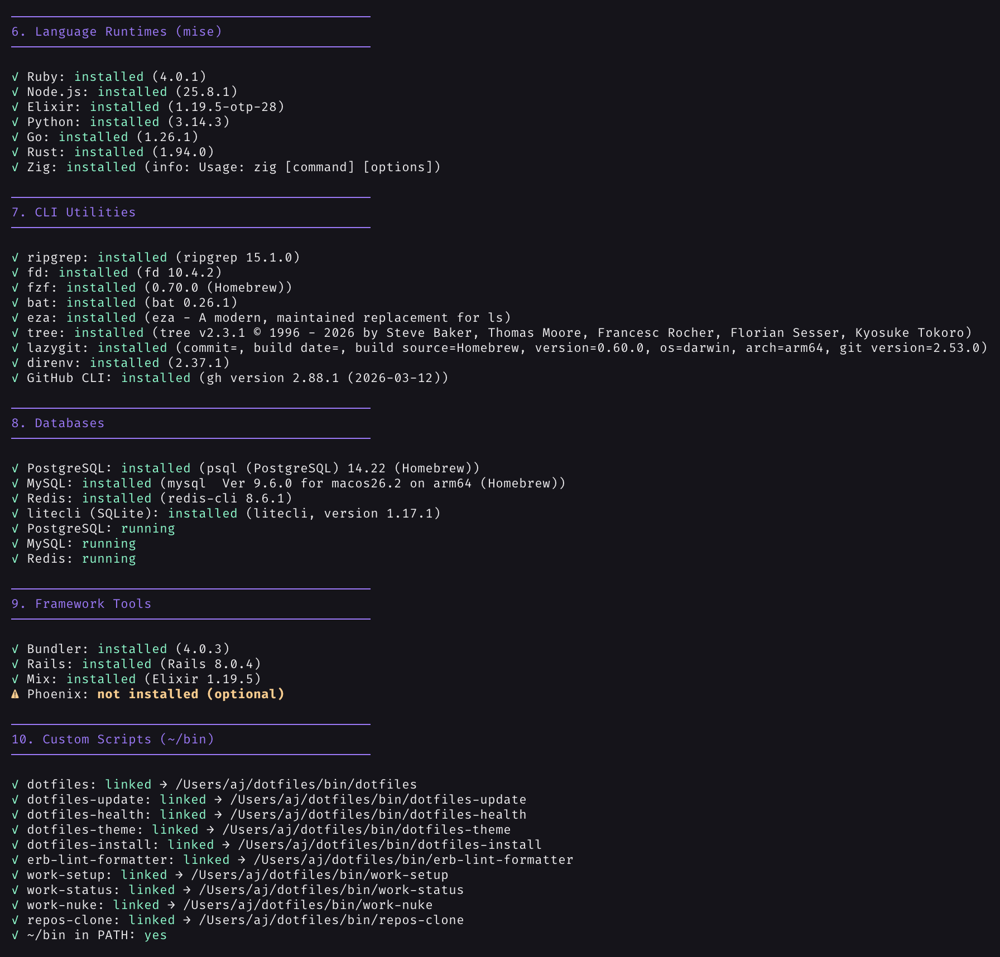
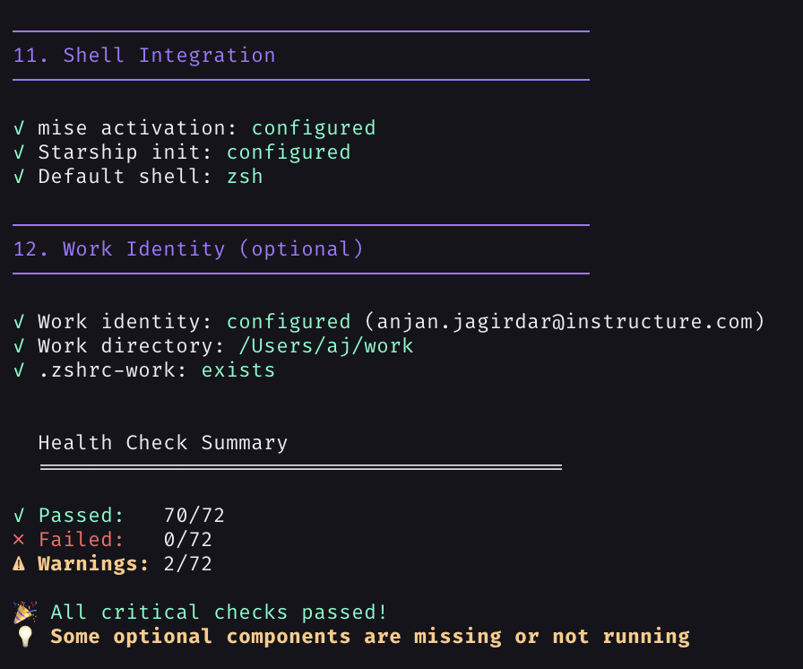
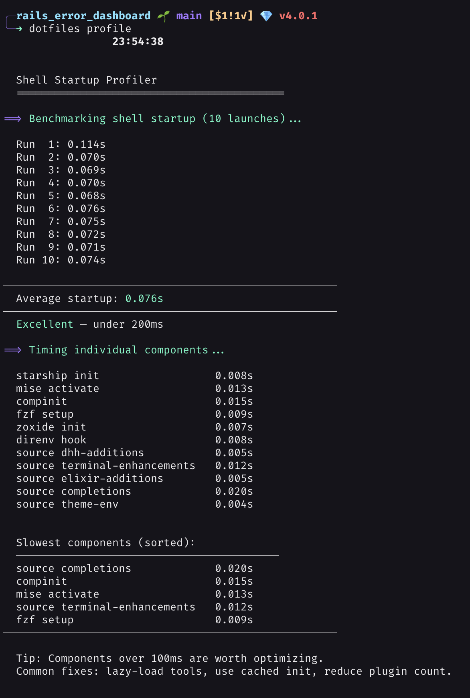
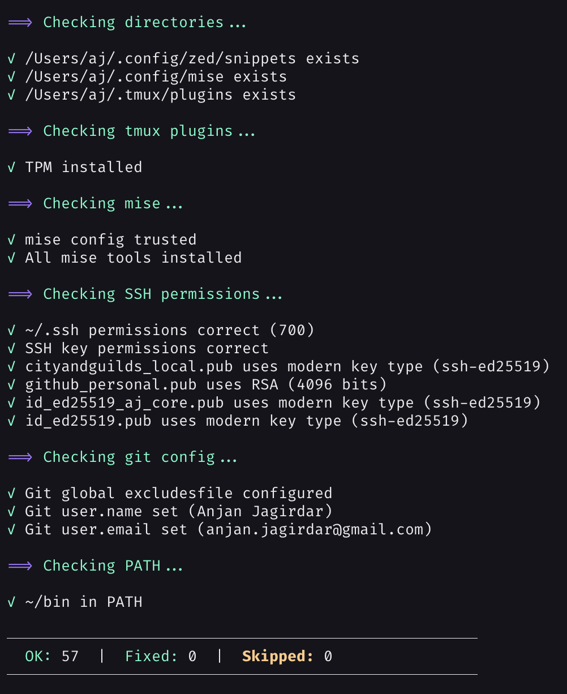
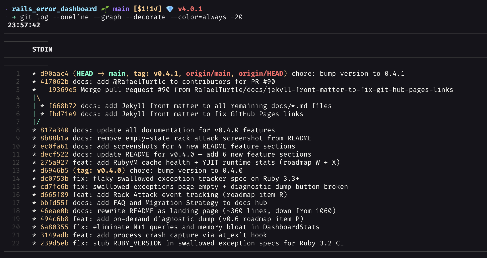
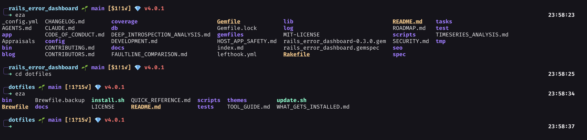

# 🚀 AJ's Dotfiles

[](https://buymeacoffee.com/anjanj)
[](https://github.com/sponsors/AnjanJ)

> A complete macOS development environment — Ruby/Rails, Elixir/Phoenix, Node/React, Python, Go, Rust, Zig — with your choice of Tokyo Night, Aura Dark, or Catppuccin Mocha theme applied everywhere.

<p align="center">
  
</p>

<details>
<summary><strong>More screenshots</strong></summary>

### Neovim (AstroNvim + Aura Dark)


### lazygit


### Theme Picker


### Health Check




### Shell Startup Profiler


### Doctor (Auto-fix)



### Git Log


### Directory Listing (eza)


</details>

## 💭 Philosophy

This setup is inspired by **DHH's Omakub** and his "**Everything in one place, everything just works**" philosophy. The goal is simple:

### Core Principles

1. **One Command Installation** - From zero to productive development environment in minutes
2. **Unified Theme** - Choose Tokyo Night, Aura Dark, or Catppuccin Mocha — applied across 17 apps for visual consistency. If theme apply fails partway, all configs are automatically restored.
3. **Keyboard-First** - Vim motions, tiling windows, keyboard shortcuts for everything
4. **Modular Configuration** - Clean, organized configs that are easy to understand and modify
5. **Developer Ergonomics** - Tools chosen for speed, reliability, and joy of use

### The DHH/Omakub Influence

Like DHH's **[Omakub](https://omakub.org/)** for Ubuntu, this setup provides:
- **Opinionated but customizable** - Great defaults, easy to change
- **Battle-tested tools** - Used daily for professional Rails and Elixir development
- **Productivity-focused** - Everything configured to minimize friction
- **Beautiful aesthetics** - Because we stare at code all day

### Why This Stack?

| Tool | Why |
|------|-----|
| **Aerospace** | i3-style tiling for macOS — keyboard-driven, distraction-free |
| **Ghostty** | GPU-accelerated terminal, native macOS, modern |
| **Neovim + Zed** | Neovim with AstroNvim for terminal, Zed for GUI — both with full LSP |
| **zsh + Starship** | Fast, reliable shell with a beautiful prompt |
| **Zellij** | Rust-based terminal multiplexer with on-screen hints + Rails/Phoenix/Work layouts |
| **Tokyo Night / Aura / Catppuccin** | Choose your theme — applied consistently across all tools |

## ✨ Features

### 🎨 Theme System (Tokyo Night, Aura Dark, or Catppuccin Mocha)

Choose your theme during install — it's applied across **22 apps**:

| Auto-configured (16) | Manual (links provided) |
|----------------|------------------------|
| Neovim, Ghostty, Zellij, Starship, Zed, VS Code, Warp, bat, git-delta, fzf, lazygit, borders, sketchybar, yazi, gitui, lsd | Slack, Chrome, Firefox, Telegram, Raycast |

Switch anytime: `dotfiles theme tokyo-night`, `dotfiles theme aura`, or `dotfiles theme catppuccin`

### 🛠️ Development Tools
- **Ruby/Rails** - mise, ruby-lsp, RuboCop, RSpec tasks, ERB formatting
- **Elixir/Phoenix** - mise, elixir-ls, mix integration, tailwindcss-language-server
- **TypeScript/React** - prettier, eslint, auto-imports, inlay hints
- **Zig** - zls (auto-installed), build/test/run tasks, 26 snippets
- **Node.js** - mise, npm/yarn
- **Git** - lazygit, fugitive, gitsigns

### ⌨️ Productivity
- **Aerospace** - i3-like tiling window manager for macOS
- **Neovim + AstroNvim** - Modern Vim distribution with LSP, Treesitter, Telescope
- **Zellij** - Rust-based terminal multiplexer with on-screen hints
- **Starship** - Fast, customizable prompt (16x faster than Spaceship)
- **Harpoon** - Quick file navigation (ThePrimeagen workflow)
- **Smart CLI** - `cd` uses zoxide (frecency), `ls`→eza, `cat`→bat, `grep`→ripgrep, `find`→fd
- **Shell UX** - syntax-highlight as you type, ghost-text autosuggestions, fzf-tab fuzzy completion

### 🤖 AI-Augmented Shell
- **Claude Code** - Anthropic's coding agent (cask + VS Code extension)
- **GitHub Copilot CLI** - `ghcs` (suggest) and `ghce` (explain), built into `gh ≥ 2.49`
- **llm** (Simon Willison) - Pipe-friendly LLM CLI (`cat err.log \| llm "explain"`); plugins for OpenAI, Anthropic, Ollama, Gemini
- **ollama** - Local LLM runtime for offline / private workflows
- **Gemini CLI** - Google's terminal LLM
- **Perplexity** (Mac App Store) - AI-powered search

## 📦 What's Included

### Core Tools
- **Window Manager**: Aerospace (i3-like tiling for macOS)
- **Terminal**: Ghostty (GPU-accelerated)
- **Shell**: zsh with modular configuration
- **Prompt**: Starship
- **Multiplexer**: Zellij
- **Editors**: Neovim with AstroNvim, Zed (settings, snippets, tasks)
- **Version Control**: Git (smart defaults, respects `$EDITOR`, per-directory identity), lazygit, GitHub CLI
- **Work Management**: work-setup, work-nuke, work-switch, work-status, repos-clone
- **Dotfiles CLI**: `dotfiles update`, `dotfiles sync`, `dotfiles health`, `dotfiles theme`, `dotfiles add-theme`, `dotfiles cleanup`, `dotfiles doctor`, `dotfiles backup`, `dotfiles profile`, `dotfiles export`
- **Custom Scripts**: `~/bin` (erb-lint-formatter, etc.)

### Development
- **mise** - Modern version manager (replaces rbenv, nvm, asdf)
- Ruby (latest via mise)
- Elixir + Erlang (latest)
- Node.js (latest)
- Python 3
- Zig
- Go, Rust (latest)
- PostgreSQL 14
- MySQL
- Redis
- SQLite (via litecli)

### CLI Utilities
- ripgrep, fd, fzf, fzf-tab (fuzzy finding + completion)
- bat (cat with syntax highlighting)
- eza (modern ls)
- jq (JSON pipeline tooling)
- tree (directory visualization)
- yazi (terminal file manager)
- lnav, tailspin (log viewers)
- zsh-autosuggestions, zsh-syntax-highlighting (shell UX)

## 🎯 One-Command Installation

### Before you run it (fresh Mac prerequisites)

These are quick one-time things macOS itself needs before `install.sh` can work:

| # | What | Why |
|---|------|-----|
| 1 | **Sign in to Apple ID** (System Settings → Sign In) | Required for the 12 Mac App Store apps in the Brewfile (1Password Safari extension, Xcode, Kindle, Numbers, Perplexity, etc.) |
| 2 | **Open the App Store app and sign in once** | The `mas` CLI uses an active App Store session |
| 3 | **Xcode Command Line Tools** | `install.sh` triggers the install dialog automatically if missing — just click *Install* and re-run when done (~3 min) |

That's it. Everything else (Homebrew, all packages, 1Password app + CLI, all configs, theme, AI tooling) is automated.

### Quick Install (from a fresh Mac)

```bash
bash <(curl -fsSL https://raw.githubusercontent.com/AnjanJ/dotfiles/main/install.sh)
```

Or if you prefer to clone first:

```bash
git clone https://github.com/AnjanJ/dotfiles.git ~/dotfiles && bash ~/dotfiles/install.sh
```

Both are **fully non-interactive** with sensible defaults. No prompts, no questions — just run it.

### Customize via flags

```bash
bash install.sh --name "AJ" --email "aj@example.com" --theme aura
bash install.sh --work-email "aj@corp.com" --ssh generate
bash install.sh --interactive          # Prompt for every choice (old behavior)
bash install.sh --groups "core,editors,databases"  # Install only specific package groups
bash install.sh --no-macos-defaults    # Skip macOS system preferences
bash install.sh --force                # Force reinstall everything
bash install.sh --help                 # Show all options
```

### What it does

1. ✅ Install Homebrew (if not installed)
2. ✅ Install packages from Brewfile (interactive mode lets you select package groups; `--groups` to pick specific ones)
3. ✅ Create symlinks to dotfiles (shell, Neovim, Zed, ~/bin, etc.)
4. ✅ Apply your chosen theme (Tokyo Night, Aura Dark, or Catppuccin)
5. ✅ Wire `llm-ollama` plugin (so `llm` can talk to local Ollama models)
6. ✅ Configure Neovim
7. ✅ Configure Zed (settings, snippets, tasks)
8. ✅ Set up shell environment, Git defaults, and SSH keys
9. ✅ Apply macOS defaults
10. ✅ Run health check

**💡 Truly idempotent** — run it 10 times, get the same result. No backup clutter, no duplicate configs, no re-prompting.

**📋 Want the full package list?** Read [`Brewfile`](Brewfile) directly — it's organized into `@group` sections (core, editors, work, databases, etc.) with comments explaining each tool.

### What Gets Installed

```
Installed Tools:
├── Window Management
│   └── Aerospace (i3-like tiling)
├── Terminals
│   └── Ghostty (GPU-accelerated)
├── Shell
│   ├── zsh (modular configuration)
│   └── Starship prompt
├── Multiplexers
│   ├── Zellij (with rails/phoenix/work layouts)
│   └── Zellij
├── Editors
│   ├── Neovim + AstroNvim
│   └── Zed
├── Languages
│   ├── Ruby + mise
│   ├── Elixir + Erlang
│   ├── Node.js
│   ├── Python
│   ├── Zig
│   ├── Go
│   └── Rust
├── Databases
│   ├── PostgreSQL 14
│   ├── MySQL
│   ├── Redis
│   └── SQLite (litecli)
├── Dotfiles CLI
│   ├── dotfiles update (upgrade & sync)
│   ├── dotfiles sync (quick refresh — pull, relink, theme)
│   ├── dotfiles health (verify setup)
│   ├── dotfiles theme (switch theme)
│   ├── dotfiles add-theme (scaffold new theme)
│   ├── dotfiles cleanup (remove unlisted Homebrew packages)
│   ├── dotfiles doctor (auto-fix issues)
│   ├── dotfiles backup (snapshot/restore)
│   ├── dotfiles profile (shell startup timing)
│   ├── dotfiles export (portable setup snapshot)
│   ├── dotfiles install (run installer)
│   ├── dotfiles uninstall (remove symlinks)
│   └── dotfiles edit / dir (open editor / print path)
├── Work Management
│   ├── work-setup (configure work identity)
│   ├── work-nuke (remove work config)
│   ├── work-switch (change employer)
│   ├── work-status (show current setup)
│   └── repos-clone (clone from GitHub/GitLab/Bitbucket/Codeberg)
├── Custom Scripts
│   └── ~/bin (erb-lint-formatter, etc.)
└── Tools
    ├── Git + lazygit
    ├── ripgrep, fd, fzf
    └── bat, eza, tree
```

## 📖 Configuration Structure

### Modular Shell Setup

The `.zshrc` is organized into focused, modular files:

```
~/.zshrc                         # Main config (loads everything)
~/.zshrc-dhh-additions           # DHH-inspired workflows
~/.zshrc-elixir-additions        # Elixir/Phoenix tools
~/.zshrc-terminal-enhancements   # Zellij + Neovim aliases, fzf-tab, zsh-autosuggestions, llm/AI tooling
~/.zshrc-work                    # Work-specific settings (optional)
```

**Why modular?**
- Easy to understand and modify
- Enable/disable features by commenting one line
- Share common configs, keep private ones separate
- Inspired by DHH's clean, organized approach

### Philosophy Behind File Organization

```
dotfiles/
├── .zshrc                      # Core: prompt, PATH, tool initialization
├── .zshrc-dhh-additions        # Rails workflows, aliases, functions
├── .zshrc-elixir-additions     # Elixir/Phoenix development
├── .zshrc-terminal-enhancements # Terminal multiplexers, editors
├── .zshrc-work                 # Work-specific (created by work-setup, not in repo)
├── .tmux.conf                  # tmux config (kept for forks; tmux not in default Brewfile)
├── .config/
│   ├── aerospace/              # Window management: layouts, keybindings
│   ├── ghostty/                # Terminal: theme, fonts
│   ├── mise/                   # Version manager (Ruby, Node, Elixir, etc.)
│   ├── nvim/                   # Editor: LSP, plugins, keymaps
│   ├── zed/                    # Zed: settings, snippets, tasks
│   ├── zellij/                 # Multiplexer: config, theme, layouts (rails, phoenix, work)
│   ├── lazygit/                # Git UI: config + theme
│   ├── borders/                # JankyBorders: active window highlighting
│   ├── sketchybar/             # Menu bar: config + plugins
│   └── starship.toml           # Prompt: git, languages, colors
├── bin/                        # Custom scripts (erb-lint-formatter, etc.)
└── Brewfile                    # Declarative package management
```

Each file has a single responsibility. Want to change your Rails workflow? Edit `.zshrc-dhh-additions`. Need different terminal aliases? Modify `.zshrc-terminal-enhancements`.

## 📖 Quick Start Guide

### After Installation

1. **Restart your terminal**
   ```bash
   source ~/.zshrc
   ```

2. **Open Neovim** (plugins auto-install)
   ```bash
   nvim
   ```

4. **Start Aerospace**
   ```bash
   aerospace reload
   # Or: logout and login again
   ```

### Essential Keybindings

#### Aerospace (Window Management)
**Note**: Uses `Ctrl+Shift` for international keyboard compatibility (DHH-inspired)

| Key | Action |
|-----|--------|
| `Ctrl+Shift+H/J/K/L` | Focus window (vim-style navigation) |
| `Ctrl+Alt+H/J/K/L` | Move window |
| `Ctrl+Shift+1-9` | Switch to workspace 1-9 |
| `Ctrl+Alt+1-9` | Move window to workspace 1-9 |
| `Ctrl+Shift+Tab` | Toggle between last two workspaces |
| `Ctrl+Shift+/` | Toggle layout (tiles/accordion) |
| `Ctrl+Shift+-` | Decrease window size |
| `Ctrl+Shift+=` | Increase window size |

**App Launchers** (Workspace-aware):
| Key | App | Workspace |
|-----|-----|-----------|
| `Ctrl+Shift+C` | Chrome (work) | 1 |
| `Ctrl+Shift+Z` | Zed editor | 2 |
| `Ctrl+Shift+W` | Ghostty terminal | 3 |
| `Ctrl+Shift+F` | Firefox (personal) | 5 |
| `Ctrl+Shift+G` | Ghostty terminal | 7 |
| `Ctrl+Shift+O` | Obsidian (PKM) | 8 |
| `Ctrl+Shift+P` | 1Password | 9 |

**Browser Window Cycling** (across all workspaces):
| Key | Action |
|-----|--------|
| `Ctrl+Shift+N` | Next Chrome window |
| `Ctrl+Shift+B` | Previous Chrome window |
| `Alt+Shift+N` | Next Firefox window |
| `Alt+Shift+B` | Previous Firefox window |

#### Neovim (Leader: `Space`)
| Key | Action |
|-----|--------|
| `<Leader>ff` | Find files (Telescope) |
| `<Leader>fw` | Find word (grep) |
| `<Leader>fb` | Find buffers |
| `<Leader>ha` | Harpoon: add file |
| `Ctrl+H/J/K/L` | Harpoon: jump to marks 1-4 |
| `gd` | Go to definition |
| `gr` | Find references |
| `<Leader>la` | Code actions |
| `K` | Hover documentation |
| `<Leader>rc` | Rails: controller |
| `<Leader>rm` | Rails: model |
| `<Leader>rv` | Rails: view |
| `<Leader>rs` | Rails: spec |

#### Zellij
| Key | Action |
|-----|--------|
| `Ctrl+O` | Enter command mode (shows options) |
| `Ctrl+G` | Lock mode (pass keys to terminal) |
| `Alt+H/J/K/L` | Navigate panes |
| `Ctrl+Q` | Quit Zellij |

**Zellij Layouts** (pre-configured via aliases):
| Alias | Layout | Tabs |
|-------|--------|------|
| `zr` | Rails | editor, server (rails s + console), tests, terminal |
| `zp` | Phoenix | editor, server (phx.server + iex), tests, terminal |
| `zw` | Work | editor, server (two panes), terminal |

## 🤖 AI-Augmented Shell

A modern shell needs AI tooling. This setup wires LLMs into your daily flow without taking over the terminal.

### Quick reference

| Tool | What it does | Trigger |
|------|--------------|---------|
| **Claude Code** | Full coding agent (CLI + IDE) | `claude` or VS Code/Zed extension |
| **GitHub Copilot CLI** | Suggests/explains shell commands | `ghcs` / `ghce` |
| **llm** | Pipe text → LLM, get text back | `\| llm "..."` |
| **ollama** | Run LLMs locally (offline + private) | `ollama run <model>` or via `llm` |
| **Gemini CLI** | Google's terminal LLM | `gemini` |
| **explain-last** | "What did that command do?" | `explain-last` |

> **Why `llm` and not `mods`?** Earlier versions of this setup used [`mods`](https://github.com/charmbracelet/mods), but Charmbracelet sunset that project on 2026-03-09 (issues like #561 — Ollama streaming output looping — were never patched). Simon Willison's [`llm`](https://llm.datasette.io/) is the modern replacement: actively maintained, plugin-based, works cleanly with Ollama via `llm-ollama`.

### `llm` — your everyday LLM pipe

`llm` reads stdin and prints the model's response. The unix way to use AI.

```bash
# Diagnose an error
cat /var/log/system.log | tail -50 | llm "anything concerning here?"

# Generate a commit message from your diff
git diff --staged | llm -s "write a concise conventional-commit message; output only the message"

# Convert a CSV to JSON
cat data.csv | llm "convert to JSON, keep types"

# Refactor on the fly
cat script.sh | llm "rewrite this in idiomatic Python 3.12, keep behavior identical"

# One-shot questions
llm "explain SIGPIPE in 3 sentences"
```

The `-s` flag sends the next argument as a system prompt. The `-m` flag picks a specific model. `-c` continues the previous conversation. `--no-stream` returns the full response at once instead of streaming.

**First-time setup** (already done in this dotfiles setup):

```bash
# Plugin for local Ollama models (one-time)
llm install llm-ollama

# Optional: add hosted-API plugins
llm install llm-anthropic llm-gemini

# Set a default model — qwen2.5-coder:7b is local, fast, private
llm models default qwen2.5-coder:7b

# Set API keys when you want hosted models
llm keys set openai           # paste key when prompted
llm keys set anthropic
```

**Switch models per call:**

```bash
llm -m qwen2.5-coder:7b "..."   # local, default
llm -m gpt-4o "..."             # OpenAI, hosted
llm -m claude-sonnet-4-5 "..."  # Anthropic, hosted
llm models                      # list everything available
```

**Templates** save reusable system prompts:

```bash
llm "you are a senior engineer reviewing code; be terse" --save reviewer
cat src/auth.rb | llm -t reviewer

llm 'you write conventional-commit messages: subject under 72 chars, body explains why' --save commit
git diff --staged | llm -t commit
```

Templates live at `~/Library/Application Support/io.datasette.llm/templates/`.

**Continue a conversation:**

```bash
llm "what is currying?"
llm -c "give me a JS example"   # remembers the previous answer
llm logs                         # see history
```

### `gh copilot` — built into `gh`

Already comes with `gh ≥ 2.49`. Two subcommands, two aliases:

```bash
ghcs "find files larger than 100MB modified in the last week"
# Suggests: find . -type f -size +100M -mtime -7

ghce "git rebase --interactive HEAD~5"
# Explains the command in plain English
```

Requires an active GitHub Copilot subscription. First run prompts for auth.

### `ollama` — local LLMs (offline + private)

Local models run on your Mac. No data leaves your machine. Great for:
- Sensitive code/logs you can't send to a hosted API
- Offline work (flight, travel)
- Cheap experimentation without per-token costs
- Latency-sensitive use cases

**Architecture:**
- **Ollama** is the *server* — it loads `.gguf` weights, runs them on Apple Silicon GPU, exposes an HTTP API at `localhost:11434`. Internally it uses [llama.cpp](https://github.com/ggerganov/llama.cpp).
- **`llm` + `llm-ollama` plugin** is the *client* — pipes stdin to the server. You don't talk to ollama directly except to `pull` / `list` / `rm` models.

**Setup:**

```bash
# Pull a coding-tuned model (~5GB) — recommended default
ollama pull qwen2.5-coder:7b

# List what you have on disk
ollama list

# Tell `llm` about it (rescan plugin registrations)
llm models | grep -i ollama
```

**Use directly (occasional):**

```bash
ollama run qwen2.5-coder:7b "write a bash function that retries N times"
```

**Use via `llm` (the daily driver):**

```bash
cat error.log | llm -m qwen2.5-coder:7b "explain"
# Or, if you set qwen2.5-coder:7b as default:
cat error.log | llm "explain"
```

**Recommended models** (download once, use forever):

| Model | Size | Best for |
|-------|------|----------|
| `qwen2.5-coder:7b` | 4.7 GB | **Recommended default.** Code review, refactoring, explanations |
| `qwen2.5-coder:14b` | 9 GB | Stronger code reasoning, larger refactors |
| `qwen3:14b` | ~9 GB | General reasoning / harder thinking tasks (when 7b isn't enough) |
| `llama3.1:8b` | 4.7 GB | General Q&A, summarization |
| `nomic-embed-text` | 274 MB | Embeddings (RAG, semantic search) |

> Two-model strategy: keep `qwen2.5-coder:7b` as default for fast coding tasks, and a larger general model (e.g. `qwen3:14b`) for harder reasoning. Switch per call: `llm -m qwen3:14b "..."`.

### `explain-last` — instant context

Custom function in `.zshrc-terminal-enhancements`. Pipes your last shell command through `llm`:

```bash
$ find . -name "*.rb" -mtime -1 -exec rg -l "TODO" {} \;
# ...output...

$ explain-last
# llm explains what the find/rg pipeline does
```

### Picking the right tool

- **"I need a coding agent that can edit my files."** → Claude Code
- **"I forgot the syntax for X."** → `ghcs "X"`
- **"What does this regex/pipe do?"** → `ghce "..."` or `explain-last`
- **"Process this stdin and give me text back."** → `llm`
- **"I'm offline / this is sensitive."** → ollama via `llm` (default), or `ollama run` directly
- **"I want a chat-style interface."** → Claude Code app, Perplexity, or `llm chat`

## 🐚 Shell UX Enhancements

Three plugins make typing in zsh feel like an editor:

### `zsh-syntax-highlighting`
Colors commands as you type. Valid commands turn green, unknown ones stay red — catch typos before pressing enter. Quoted strings, paths, options, and operators are all distinctly colored.

### `zsh-autosuggestions`
Fish-style ghost text. As you type, your shell shows the rest of a previous command in dim gray. Press **→** (right arrow) or **End** to accept. The strategy is `(history completion)` — history first, then tab-completion-aware fallbacks.

```bash
$ git c█           # ghost text shows "git commit -m"
$ git commit -m    # press → to accept
```

### `fzf-tab`
Replaces zsh's default tab-complete menu with an fzf fuzzy picker. Every `<Tab>` becomes a searchable menu with previews:

```bash
cd <Tab>            # fuzzy-pick a directory
git checkout <Tab>  # fuzzy-pick a branch (preview shows git log)
kill <Tab>          # fuzzy-pick a process
ssh <Tab>           # fuzzy-pick a host from ~/.ssh/config
```

Type to filter. Enter to select. Esc to cancel.

## 🎨 Theming

Choose between **[Tokyo Night](https://github.com/folke/tokyonight.nvim)** (dark blue), **[Aura Dark](https://github.com/daltonmenezes/aura-theme)** (deep purple), or **[Catppuccin Mocha](https://github.com/catppuccin/catppuccin)** (warm pastels) during install. The theme is applied across 22 apps (17 auto-configured + 5 with manual instructions).

> Browse the full galleries: [Tokyo Night](https://github.com/folke/tokyonight.nvim#readme) | [Aura Dark](https://github.com/daltonmenezes/aura-theme#readme) | [Catppuccin](https://github.com/catppuccin/catppuccin#-showcase)

| | Tokyo Night | Aura Dark | Catppuccin Mocha |
|---|-----------|-----------|-----------------|
| **Background** | `#1a1b26` | `#15141b` | `#1e1e2e` |
| **Foreground** | `#c0caf5` | `#edecee` | `#cdd6f4` |
| **Primary accent** | `#7aa2f7` blue | `#a277ff` purple | `#b4befe` lavender |
| **Secondary** | `#bb9af7` purple | `#61ffca` green | `#94e2d5` teal |
| **Success** | `#9ece6a` green | `#61ffca` green | `#a6e3a1` green |
| **Error** | `#f7768e` red | `#ff6767` red | `#f38ba8` red |
| **Warning** | `#e0af68` yellow | `#ffca85` orange | `#f9e2af` yellow |

Switch anytime: `dotfiles theme tokyo-night`, `dotfiles theme aura`, or `dotfiles theme catppuccin`

## 📁 Repository Structure

```
dotfiles/
├── install.sh                  # Main installation script (idempotent)
├── update.sh                   # Update script for syncing changes
├── Brewfile                    # Homebrew packages (auto-generated)
├── README.md                   # This file
├── QUICK_REFERENCE.md          # Cheat sheet
├── .zshrc                      # Main shell config
├── .zshrc-dhh-additions        # Rails workflows
├── .zshrc-elixir-additions     # Elixir/Phoenix
├── .zshrc-terminal-enhancements # Terminal tools
├── .tmux.conf                  # tmux config (kept for forks; tmux not in default Brewfile)
├── .config/
│   ├── aerospace/              # Window manager config
│   ├── ghostty/                # Terminal config
│   ├── mise/                   # Version manager (Ruby, Node, Elixir, etc.)
│   ├── nvim/                   # Neovim config (AstroNvim)
│   ├── zed/                    # Zed editor config
│   │   ├── settings.json       # Language, LSP, formatter, extension settings
│   │   ├── tasks.json          # RSpec, Rails, Elixir, Zig, npm tasks
│   │   └── snippets/           # ruby.json, erb.json, zig.json
│   ├── zellij/                 # Zellij config, theme, layouts
│   ├── lazygit/                # Lazygit config + theme
│   ├── borders/                # JankyBorders window highlighting
│   ├── sketchybar/             # Menu bar config + plugins
│   └── starship.toml           # Prompt configuration
├── themes/                     # Theme assets (each has a theme.conf registry)
│   ├── tokyo-night/            # Tokyo Night configs per app
│   ├── aura/                   # Aura Dark configs per app
│   └── catppuccin/             # Catppuccin Mocha configs per app
├── bin/                        # CLI commands (all available globally via ~/bin)
│   ├── dotfiles                # Main CLI dispatcher
│   ├── dotfiles-update         # Upgrade system & sync repo
│   ├── dotfiles-sync           # Quick refresh: pull, relink, reapply theme
│   ├── dotfiles-health         # Verify all tools are installed
│   ├── dotfiles-theme          # Switch theme
│   ├── dotfiles-install        # Run full installer
│   ├── dotfiles-uninstall      # Remove all dotfiles symlinks
│   ├── dotfiles-backup         # Snapshot/restore dotfiles state
│   ├── dotfiles-doctor         # Auto-fix common issues + SSH key audit
│   ├── dotfiles-profile        # Measure shell startup time
│   ├── dotfiles-export         # Export setup as portable snapshot
│   ├── dotfiles-add-theme      # Scaffold new theme directory
│   ├── dotfiles-cleanup        # Remove unlisted Homebrew packages
│   ├── work-setup              # Configure work identity
│   ├── work-nuke               # Remove all work config
│   ├── work-switch             # Change employer
│   ├── work-status             # Show current work setup
│   ├── repos-clone             # Clone repos from GitHub/GitLab/Bitbucket/Codeberg
│   ├── erb-lint-formatter      # ERB lint wrapper for Zed
│   └── _work-helpers           # Shared utilities for work scripts
├── scripts/
│   ├── _helpers.sh             # Shared colors & print functions
│   ├── setup-git.sh            # Git identity & defaults setup
│   ├── setup-ssh.sh            # SSH key & config setup
│   ├── health-check.sh         # Verify installation
│   ├── theme-utils.sh          # Theme utility functions
│   └── apply-theme.sh          # Apply theme across all apps
├── tests/                      # 300 tests across 11 suites, run via GitHub Actions CI
│   ├── test-idempotency.sh     # Idempotency tests (sandboxed)
│   ├── test-work-nuke.sh       # Work-nuke edge case tests
│   ├── test-repos-clone.sh     # Repos-clone logic tests
│   ├── test-ssh-adversarial.sh # SSH adversarial input tests
│   ├── test-update.sh          # Update symlink tests
│   ├── test-theme.sh           # Theme system tests (apply, rollback, scaffold)
│   ├── test-doctor.sh          # Doctor auto-fix tests
│   ├── test-setup-git.sh       # Git identity setup tests
│   ├── test-work-status.sh     # Work status diagnostic tests
│   ├── test-backup.sh          # Backup/restore cycle tests
│   └── test-sync.sh            # Sync symlink refresh tests
├── .github/workflows/test.yml  # CI: shellcheck + all test suites
└── docs/                       # Additional documentation
```

## 🔄 Maintenance

All commands work from anywhere — no need to `cd ~/dotfiles` first.

### Dotfiles CLI

```bash
dotfiles update       # Upgrade system & sync repo (pull → brew upgrade → snapshot → push)
dotfiles sync         # Quick refresh: pull, relink, reapply theme (no upgrades)
dotfiles health       # Verify all tools are installed and configured
dotfiles theme aura   # Switch theme (tokyo-night | aura | catppuccin)
dotfiles add-theme x  # Scaffold a new theme directory with all required files
dotfiles cleanup      # Find/remove Homebrew packages not in Brewfile (--force)
dotfiles doctor       # Auto-fix common issues (symlinks, permissions, SSH keys)
dotfiles backup       # Snapshot dotfiles state (--list, --restore <name>)
dotfiles profile      # Measure shell startup time (--detailed for per-component)
dotfiles export       # Export setup snapshot (--json for machine-readable)
dotfiles install      # Re-run full installer (idempotent)
dotfiles edit         # Open dotfiles in your editor
dotfiles dir          # Print dotfiles directory path
```

All commands support tab-completion. Shorthand also works: `dotfiles-update`, `dotfiles-sync`, etc.

### What `dotfiles update` does

1. Pull latest changes from git
2. `brew update` + `brew upgrade` + `brew cleanup`
3. Snapshot installed packages and show diff against Brewfile (without overwriting the organized Brewfile)
4. Refresh all symlinks
5. Upgrade mise tools
6. Reload live configs (aerospace, tmux if present)
7. Commit & push changes back to repo

**Your Brewfile stays organized.** The Brewfile is organized into `@group` sections (core, editors, work, databases, etc.) and `dotfiles update` never overwrites it. The snapshot step shows you what's new or missing compared to your system.

#### Brewfile recovery

Two layers of safety net:

**1. Git history is the source of truth.** Every previous Brewfile is one command away:

```bash
# View the previous version
git -C ~/dotfiles show HEAD~1:Brewfile

# Restore the previous version to a working file
git -C ~/dotfiles show HEAD~1:Brewfile > /tmp/Brewfile.previous

# Roll the tracked Brewfile back N commits and reinstall
git -C ~/dotfiles checkout HEAD~1 -- Brewfile
brew bundle install --file=~/dotfiles/Brewfile
```

**2. `Brewfile.backup` (local only, gitignored).** `dotfiles update` writes a copy of the *previous* Brewfile to `~/dotfiles/Brewfile.backup` before each upgrade. It's not tracked in git (no commit noise) but lives on disk for one-step rollback if an upgrade breaks your machine:

```bash
# Quick rollback after a bad `dotfiles update`
cp ~/dotfiles/Brewfile.backup ~/dotfiles/Brewfile
brew bundle install --file=~/dotfiles/Brewfile

# Inspect what changed before rolling back
diff ~/dotfiles/Brewfile.backup ~/dotfiles/Brewfile
```

The on-disk backup only holds the *most recent* previous state. For older versions, use `git log -- Brewfile` to find the commit and `git show <sha>:Brewfile` to restore.

### Health Check

```bash
dotfiles health
```

Verifies: core tools, config symlinks, language runtimes, running services (PostgreSQL, MySQL, Redis), shell integrations, and work identity.

### Re-run Installation

The install script is **truly idempotent** — run it any number of times with identical results:

```bash
dotfiles install                    # Non-interactive, skips what's done
dotfiles install --interactive      # Prompt for every choice
dotfiles install --force            # Force reinstall everything
```

## 🔧 Customization

### Switch Theme

Switch between Tokyo Night, Aura Dark, and Catppuccin Mocha from anywhere:

```bash
dotfiles theme tokyo-night  # Switch to Tokyo Night
dotfiles theme aura         # Switch to Aura Dark
dotfiles theme catppuccin   # Switch to Catppuccin Mocha
```

This updates 16 apps automatically (Neovim, Ghostty, Zellij, Starship, Zed, VS Code, Warp, bat, git-delta, fzf, lazygit, borders, sketchybar, yazi, gitui, lsd), then prints instructions for Slack, browsers, Telegram, and Raycast. If the apply fails partway through, all configs are automatically rolled back.

Adding a new theme is just creating a `themes/<name>/` directory with a `theme.conf` — themes are auto-discovered, no code changes needed. Use `dotfiles add-theme <name>` to scaffold the full directory structure.

### Add More Packages

Edit `Brewfile` and run:
```bash
brew bundle install
```

### Customize Zed

- **Settings**: `.config/zed/settings.json` (languages, LSP, formatters)
- **Tasks**: `.config/zed/tasks.json` (RSpec, Rails, Zig, etc.)
- **Snippets**: `.config/zed/snippets/` (ruby.json, erb.json, zig.json)

### Modify Keybindings

- **Aerospace**: `.config/aerospace/aerospace.toml`
- **Zellij**: `.config/zellij/config.kdl`
- **Neovim**: `.config/nvim/lua/plugins/*.lua`

## 🔒 SSH & Security

### 1Password SSH Agent (Recommended — and now auto-detected)

The Brewfile installs the 1Password app + CLI automatically. SSH-agent wiring auto-detects:

- If 1Password is signed in **and** the SSH Agent is enabled before you run `install.sh`, the install wires `~/.ssh/config` to the agent socket automatically.
- If 1Password isn't ready yet, install skips SSH setup and prints a hint.

**Fresh-Mac flow** (the order I personally recommend):

1. Run `install.sh` — this lands the 1Password app along with everything else.
2. Open 1Password.app → sign in to your account → vaults sync from cloud.
3. **1Password → Settings → Developer → "Set Up SSH Agent"** (toggle ON).
4. Run the SSH wiring step now that the agent is alive:
   ```bash
   bash ~/dotfiles/scripts/setup-ssh.sh
   ```
5. Test with Touch ID: `ssh -T git@github.com`.

> **Where do my SSH keys come from?** They must already be in your 1Password vault (synced automatically from a previous machine), or added manually via 1Password → New Item → SSH Key (generate or paste). The dotfiles only configure the *agent*, not the keys.

**What this gives you:**

- **Touch ID for git push** — each new terminal session requires biometric approval before SSH operations
- **No key files on disk** — keys live in your 1Password vault, encrypted and synced
- **Works everywhere** — GitHub, GitLab, Bitbucket, Codeberg, self-hosted Git

**How it works under the hood:**
1. Install symlinks `~/.1password/agent.sock` to 1Password's actual socket
2. `~/.ssh/config` sets `IdentityAgent ~/.1password/agent.sock`
3. When you `git push` in a new terminal session, 1Password prompts for Touch ID
4. Approval lasts until 1Password locks (configurable timeout)

**Recommended 1Password settings for maximum security:**
| Setting | Value | Why |
|---------|-------|-----|
| Ask approval for each new | `application and terminal session` | Per-tab approval, not global |
| Remember key approval | `until 1Password locks` | Approval expires on lock |
| Auto-lock after idle | `1 minute` (or shortest you're comfortable with) | Frequent re-authentication |

> **Note:** This is per-session, not per-push. Once you approve in a terminal tab, subsequent pushes in that tab go through until 1Password locks. For additional protection, consider a short auto-lock timeout.

See [QUICK_REFERENCE.md](QUICK_REFERENCE.md#ssh-setup) for SSH troubleshooting and testing commands.

## 🆘 Troubleshooting

### Homebrew Not Found
```bash
# Apple Silicon
eval "$(/opt/homebrew/bin/brew shellenv)"

# Intel
eval "$(/usr/local/bin/brew shellenv)"
```

### tmux Plugins Not Loading (only if you re-added tmux to your fork)
tmux is no longer in the default Brewfile (replaced by Zellij). If you re-added it:
```bash
rm -rf ~/.tmux/plugins
git clone https://github.com/tmux-plugins/tpm ~/.tmux/plugins/tpm
tmux
# Press: Ctrl+A then Shift+I
```

### Neovim Errors
```bash
# Clear cache and reinstall
rm -rf ~/.local/share/nvim
rm -rf ~/.cache/nvim
nvim  # Will reinstall everything
```

### Aerospace Not Starting
```bash
# Reload configuration
aerospace reload

# Or restart
killall Aerospace
open -a Aerospace
```

## 📚 Documentation

Detailed guides for each tool:

- [Brewfile](Brewfile) - Full package list, grouped by purpose
- [Quick Reference](QUICK_REFERENCE.md) - Print this!
- [Neovim Guide](.config/nvim/README.md)
- [Daily Workflows](docs/DAILY_WORKFLOWS.md)

## 🧪 Testing

300 automated tests across 11 suites run on every push and PR via GitHub Actions:

- **Shellcheck** — lints all shell scripts (auto-discovers via glob patterns)
- **Idempotency** — verifies install/setup can run multiple times safely (84 assertions)
- **Work identity** — tests setup, nuke, switch lifecycle, and status diagnostics
- **SSH config** — adversarial inputs and edge cases
- **Repo cloner** — SSH alias detection and URL rewriting
- **Update flow** — symlink creation and refresh
- **Theme system** — apply, rollback, idempotency, scaffolding (39 assertions)
- **Doctor** — auto-fix symlinks, permissions, dry-run mode
- **Git setup** — identity configuration, work/personal split, smart defaults
- **Backup** — create, list, restore, prune cycle
- **Sync** — symlink refresh, broken link repair, dry-run mode

Run locally: `bash tests/test-idempotency.sh` (or any test file in `tests/`)

## 🙏 Credits

### Inspirations
- **[DHH](https://dhh.dk/)** - Omakub philosophy, Rails workflows, clean configurations
- **[Omakub](https://omakub.org/)** - "Everything in one place" installation concept
- **[ThePrimeagen](https://github.com/ThePrimeagen/.dotfiles)** - Harpoon workflow, tmux setup, vim-first development
- **[José Valim](https://github.com/josevalim/dotfiles)** - Elixir tooling and workflows

### Tools & Themes
- **[AstroNvim](https://github.com/AstroNvim/AstroNvim)** - Neovim distribution
- **[Tokyo Night](https://github.com/folke/tokyonight.nvim)** - Dark blue theme by folke
- **[Aura Theme](https://github.com/daltonmenezes/aura-theme)** - Deep purple theme by daltonmenezes
- **[Starship](https://starship.rs/)** - Fast prompt
- **[Aerospace](https://github.com/nikitabobko/AeroSpace)** - Window manager
- **[Ghostty](https://ghostty.org/)** - Modern terminal

## 📝 License

MIT License - Feel free to use and modify!

## 🤝 Contributing

Found a bug or have a suggestion? Open an issue or PR!

---

## Support

If this setup saves you time, consider sponsoring the project. It keeps development going and lets me know people are finding it useful.

<a href="https://github.com/sponsors/AnjanJ" target="_blank"></a>&nbsp;&nbsp;<a href="https://www.buymeacoffee.com/anjanj" target="_blank"></a>

---

**Made with ❤️ by [Anjan](https://anjan.dev)**

*Inspired by DHH's Omakub and ThePrimeagen's workflows*

*Last updated: 2026-03-14*
