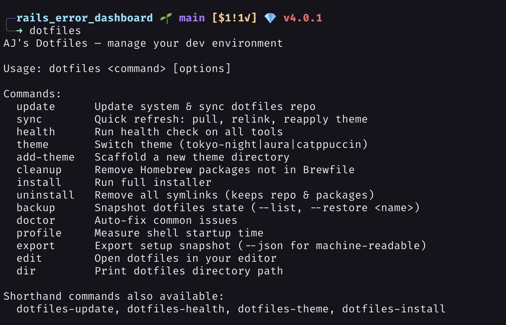
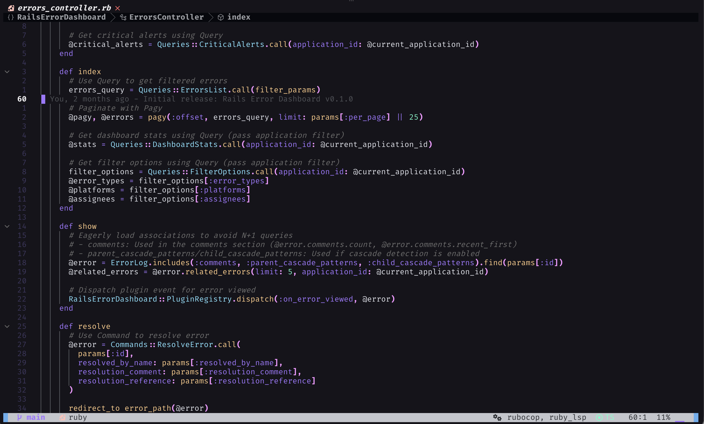
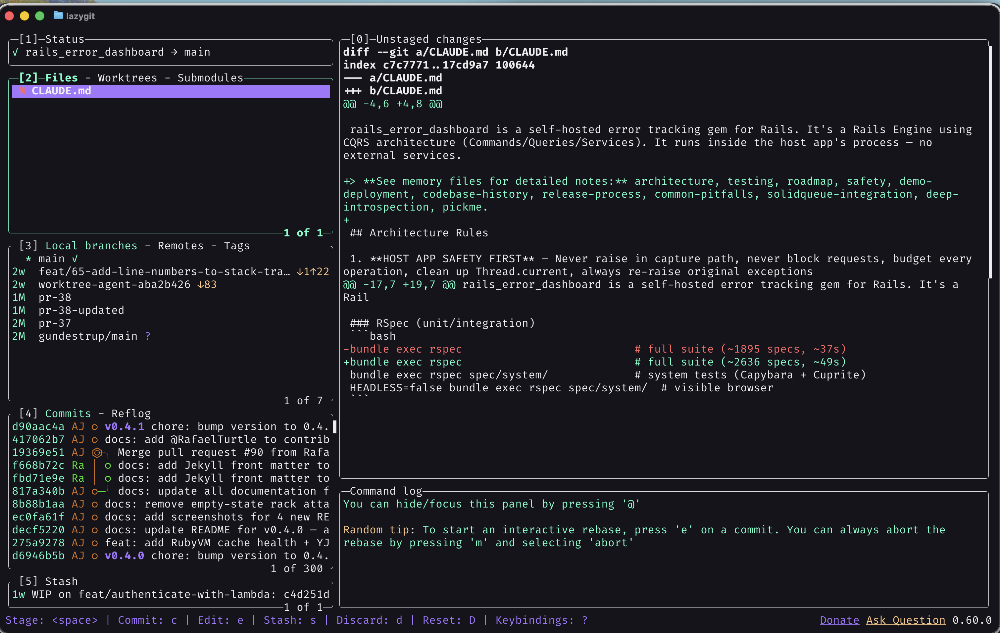
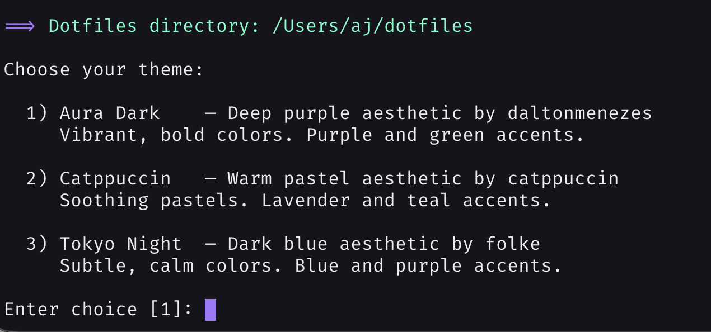
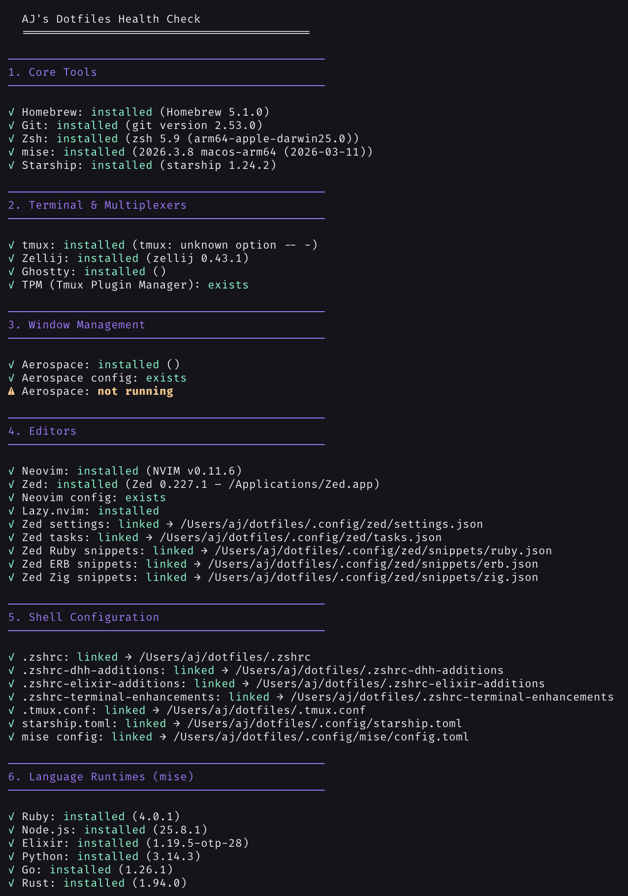
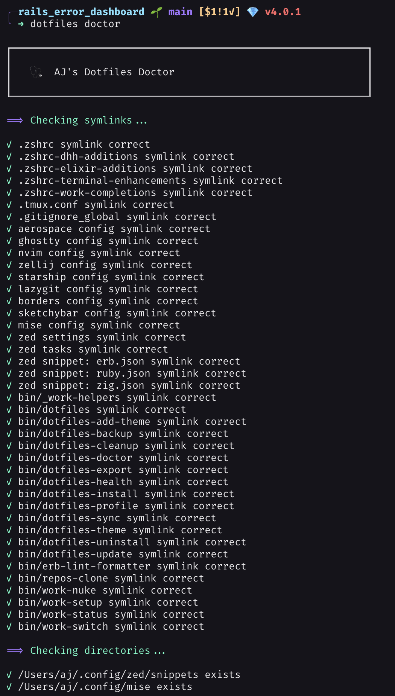

# 🚀 AJ's Dotfiles

[](https://buymeacoffee.com/anjanj)
[](https://github.com/sponsors/AnjanJ)

> A complete macOS development environment — Ruby/Rails, Elixir/Phoenix, Node/React, Python, Go, Rust, Zig — with your choice of Tokyo Night, Aura Dark, or Catppuccin Mocha applied across 21 apps.

**These are my personal dotfiles.** They're opinionated for how I work — my keybindings, my workspace layout, my editor and model choices. Everything is installable with one command and personalizable via flags, but the honest advice is: **fork it, steal the pieces you like, and adapt** rather than running it blind. The philosophy comes from DHH's [Omakub](https://omakub.org/): everything in one place, everything just works.

<p align="center">
  
</p>

<details>
<summary><strong>More screenshots</strong></summary>

### Neovim (AstroNvim + Aura Dark)


### lazygit


### Theme Picker


### Health Check


### Doctor (Auto-fix)


</details>

## What's inside

| Area | Choices |
|------|---------|
| **Window manager** | Aerospace — i3-style tiling, keyboard-first |
| **Terminal** | Ghostty (GPU-accelerated), Zellij multiplexer with Rails/Phoenix layouts |
| **Editors** | Neovim (AstroNvim) + Zed, both with full LSP, format-on-save everywhere |
| **Shell** | zsh (modular configs) + Starship prompt + fzf-tab, autosuggestions, syntax highlighting |
| **Languages** | mise-managed: Ruby, Node, Elixir/Erlang, Python, Go, Rust + Zig via zls |
| **Databases** | PostgreSQL, MySQL, Redis, SQLite |
| **Git** | lazygit, GitHub CLI, per-directory work/personal identity, 1Password SSH agent |
| **AI tooling** | Claude Code, `llm` + Ollama (local models), Copilot CLI — see [docs/AI_TOOLS.md](docs/AI_TOOLS.md) |
| **Theme system** | Tokyo Night / Aura Dark / Catppuccin Mocha across 21 apps (16 automatic, 5 manual) with rollback on failure |

## Install

**Fresh-Mac prerequisites** (one-time): sign in to your Apple ID and open the App Store once (for the `mas`-installed apps), and accept the Xcode Command Line Tools dialog when `install.sh` triggers it.

```bash
bash <(curl -fsSL https://raw.githubusercontent.com/AnjanJ/dotfiles/main/install.sh)
```

Or clone first: `git clone https://github.com/AnjanJ/dotfiles.git ~/dotfiles && bash ~/dotfiles/install.sh`

Fully non-interactive with sensible defaults, and **idempotent** — run it 10 times, get the same result. Personalize via flags:

```bash
bash install.sh --name "AJ" --email "aj@example.com" --theme aura
bash install.sh --interactive            # Prompt for every choice
bash install.sh --groups "core,editors"  # Install only specific Brewfile groups
bash install.sh --help                   # All options
```

It installs Homebrew + the [Brewfile](Brewfile) packages, links every config via the [symlink map](scripts/symlink-map.sh), applies your theme, sets up git/SSH/macOS defaults, and runs a health check.

## Daily driving

```bash
dotfiles update       # Upgrade everything & sync the repo
dotfiles sync         # Quick refresh: pull, relink, reapply theme
dotfiles health       # Verify tools, symlinks, runtimes, services
dotfiles doctor       # Auto-fix symlinks, permissions, SSH
dotfiles theme aura   # Switch theme (tokyo-night | aura | catppuccin)
```

Full CLI reference, Brewfile recovery stories, and troubleshooting: [docs/MAINTENANCE.md](docs/MAINTENANCE.md)

## Documentation

| Doc | Contents |
|-----|----------|
| [docs/PACKAGE_CATALOG.md](docs/PACKAGE_CATALOG.md) | Every package installed, by group, with one-line descriptions and links |
| [docs/KEYBINDINGS.md](docs/KEYBINDINGS.md) | Aerospace, Neovim, Zellij bindings and layouts |
| [docs/THEMES.md](docs/THEMES.md) | Palettes, switching, adding your own theme |
| [docs/AI_TOOLS.md](docs/AI_TOOLS.md) | `llm`, Ollama, Copilot CLI — the AI-augmented shell |
| [docs/SSH.md](docs/SSH.md) | 1Password SSH agent: Touch ID for git push, no keys on disk |
| [docs/STRUCTURE.md](docs/STRUCTURE.md) | Repo layout, symlink map, modular shell design |
| [docs/MAINTENANCE.md](docs/MAINTENANCE.md) | CLI reference, update flow, recovery, testing, troubleshooting |
| [docs/DAILY_WORKFLOWS.md](docs/DAILY_WORKFLOWS.md) | Day-to-day usage patterns |
| [QUICK_REFERENCE.md](QUICK_REFERENCE.md) | Printable cheat sheet |

## Design principles

1. **One command, idempotent** — from zero to productive in minutes; safe to re-run forever
2. **Single source of truth** — every managed symlink is declared once ([scripts/symlink-map.sh](scripts/symlink-map.sh)); install, update, sync, doctor, and health all read the same map, so nothing drifts silently
3. **Recovery stories everywhere** — Brewfile backups, theme rollback on partial failure, git-history restore paths
4. **Tested like software** — 13 CI suites + shellcheck on every push, because 8k lines of shell deserves tests
5. **Keyboard-first, unified aesthetics** — vim motions, tiling windows, one palette across every tool

## Credits

- **[DHH](https://dhh.dk/)** / **[Omakub](https://omakub.org/)** — the "everything in one place" philosophy
- **[ThePrimeagen](https://github.com/ThePrimeagen/.dotfiles)** — Harpoon workflow, vim-first development
- **[José Valim](https://github.com/josevalim/dotfiles)** — Elixir tooling and workflows
- **[AstroNvim](https://github.com/AstroNvim/AstroNvim)**, **[Starship](https://starship.rs/)**, **[Aerospace](https://github.com/nikitabobko/AeroSpace)**, **[Ghostty](https://ghostty.org/)** — the tools this is built on
- Themes: [Tokyo Night](https://github.com/folke/tokyonight.nvim) by folke, [Aura](https://github.com/daltonmenezes/aura-theme) by daltonmenezes, [Catppuccin](https://github.com/catppuccin/catppuccin)

## License

MIT — use and modify freely.

---

## Support

If this setup saves you time, consider sponsoring. It keeps development going and lets me know people find it useful.

<a href="https://github.com/sponsors/AnjanJ" target="_blank"></a>&nbsp;&nbsp;<a href="https://www.buymeacoffee.com/anjanj" target="_blank"></a>

**Made with ❤️ by [Anjan](https://anjan.dev)**
